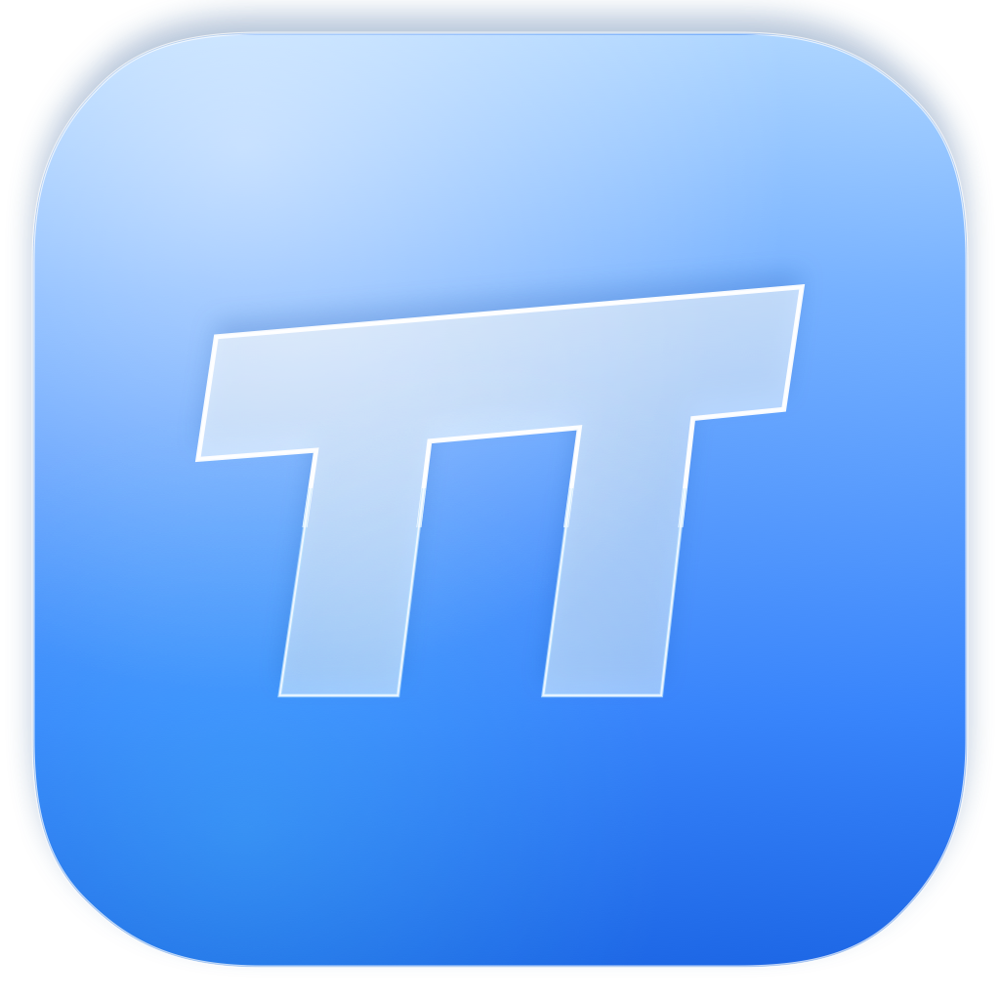
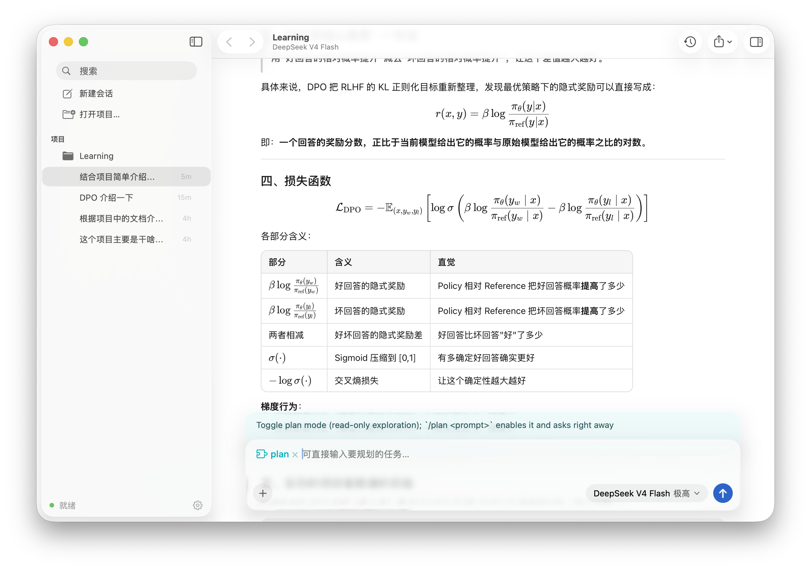

# Pi Liquid

**A fast, native macOS workspace for the [`pi`](https://github.com/earendil-works/pi) coding agent.**


<p align="center">
  
</p>



Pi Liquid replaces the terminal TUI with a focused SwiftUI workspace while
keeping `pi` itself as the agent runtime. It launches `pi --mode rpc` locally,
streams its JSONL protocol, and turns conversations, tools, approvals, files,
and git changes into a native macOS experience.

## Highlights

- **Built for macOS, not wrapped for it.** SwiftUI, unified toolbars, native
  sidebars and popovers, SF Symbols, keyboard shortcuts, system appearance,
  notifications, share sheets, and macOS 26 Liquid Glass materials.
- **A rich streaming transcript.** Assistant text, collapsible reasoning, live
  tool output, GitHub-flavored Markdown, tables, copyable code blocks, KaTeX
  math (`$...$`, `$$...$$`, `\(...\)`, `\[...\]`), and Mermaid diagrams.
- **Projects and sessions stay close.** Search, resume, rename, pin, archive,
  clone, fork, navigate backward/forward, or branch from any earlier turn.
- **An agent-aware composer.** Slash commands, prompt templates, skills,
  `@file` mentions, image paste/drop, shell mode, Plan Mode, model selection,
  reasoning effort, and steer-versus-follow-up delivery while a run is active.
- **Review changes without losing the conversation.** Per-tool diffs, per-turn
  git summaries, a Review inspector with file-level revert, and a project file
  browser sit beside the transcript.
- **Safe isolation when you need it.** Start a session in its own git worktree,
  then merge the staged result back or discard the worktree without disturbing
  the main checkout.
- **Local-first by design.** The app talks to the locally installed `pi`
  process and adds no hosted sync service or intermediary backend. Provider
  requests still follow your `pi` configuration. English and Simplified Chinese
  interfaces are included.

## Feature overview

### Conversation

- Streaming assistant responses with coalesced updates and automatic follow
- Collapsible reasoning blocks and expandable tool cards
- Live shell/tool output, stop controls, auto-retry, and context compaction
- Native extension UI for select, confirm, input, editor, and approval requests
- Context usage, token count, cost, and turn-duration feedback
- Share a conversation as an image, share its raw session file, or export HTML

### Navigation and session management

- Project-grouped session sidebar with live status indicators, plus a global
  search popover that opens on recently used sessions
- Resume, clone, fork, rename, pin, archive, and delete session workflows
- Timeline popover for forking from an earlier user prompt
- Browser-style session back/forward navigation
- Optional warm pool for instant switching between recent projects
- New projects created directly from the conversation header

### Composer and models

- Grouped `/` palette for extension commands, prompts, and skills
- Fast `@` project-file picker backed by a cached file index
- Image attachments through paste, drag and drop, or the file picker
- Leading `!` shell mode with streaming output and cancellation
- Model/provider menu and segmented reasoning-effort control
- Queued steering and follow-up messages during active runs
- Plan Mode for read-only exploration, with execution in a fresh session

### Code and workspace tools

- Edit/write tool diffs rendered inline
- Per-turn git diff capture with added/removed counts and file-level revert
- Review and Files inspector tabs that preserve conversation context
- Isolated git worktree sessions with merge-back and discard actions
- Branch picker, session notifications, and background approval alerts

## Requirements

### To run the prebuilt app

- macOS 26 or later
- A working installation of [`pi`](https://github.com/earendil-works/pi)

Install and configure `pi` first:

```bash
npm i -g @earendil-works/pi-coding-agent
pi
```

You can verify the RPC mode independently:

```bash
pi --mode rpc --no-session
```

### To build from source

- Xcode 26 / Swift 6
- [`xcodegen`](https://github.com/yonaskolb/XcodeGen)

## Install the prebuilt app

1. Download and unzip the release archive, then drag `PiLiquid.app` into
   `/Applications`.
2. The current build is ad-hoc signed and is not Apple-notarized. On first
   launch, right-click the app, choose **Open**, then confirm **Open**.
3. If Gatekeeper still blocks it, clear the downloaded quarantine attribute:

   ```bash
   xattr -dr com.apple.quarantine /Applications/PiLiquid.app
   ```

4. Launch Pi Liquid and choose **Open Project…**. If the app cannot find `pi`,
   set the executable path in **Settings** (`⌘,`).

The bundled release app is universal and contains both Apple Silicon (`arm64`)
and Intel (`x86_64`) slices.

## Build and test

Generate the Xcode project, then build or run the test suite:

```bash
brew install xcodegen
xcodegen generate

xcodebuild -project PiLiquid.xcodeproj -scheme PiLiquid \
  -configuration Debug -destination 'platform=macOS' build

xcodebuild -project PiLiquid.xcodeproj -scheme PiLiquid \
  -configuration Debug -destination 'platform=macOS' test
```

GitHub Actions also runs the tests and produces an ad-hoc signed universal
(`arm64` + `x86_64`) app archive on pushes to `main`, pull requests, and manual
workflow runs. Download `PiLiquid-macos-universal` from the workflow run's
artifacts. CI artifacts are not Apple-notarized, so the same first-launch
Gatekeeper instructions described above apply.

To open a project non-interactively:

```bash
PILIQUID_PROJECT=/path/to/repo open -a PiLiquid
```

`pi` is auto-discovered in `/opt/homebrew/bin`, `/usr/local/bin`,
`~/.local/bin`, and finally through a login-shell `command -v pi`. The path,
default provider/model, and project prewarming behavior can be changed in
Settings.

## Keyboard shortcuts

| Shortcut | Action |
| --- | --- |
| `⌘O` | Open project |
| `⌘N` | New session |
| `⌘F` | Search sessions / show recent sessions |
| `⇧⌘N` | New session in an isolated worktree |
| `⌘D` | Clone the active session |
| `⌘.` | Stop the active agent |
| `⌘[` / `⌘]` | Navigate session history backward / forward |
| `⌥⌘I` | Show or hide the Review / Files inspector |
| `⇧⌘M` | Cycle model |
| `⇧⌘L` | Cycle reasoning level |
| `⇧⌘K` | Compact context |
| `⌘,` | Settings |

## Plan Mode

The bundled Plan Mode extension makes exploration read-only by disabling
edit/write tools and restricting shell commands to a conservative inspection
allowlist. Use `/plan` to toggle it or `/plan <prompt>` to enter Plan Mode and
ask immediately. A completed plan can be handed to a new normal session while
the planning conversation remains intact.

See [Plan Mode documentation](PiLiquid/Extensions/plan-mode/README.md) for the
tool policy and command details.

## Architecture

```text
PiLiquid/
├── RPC/          typed JSONL protocol and the local `pi` child-process actor
├── Models/       session manager, transcript folding, git diffs, app settings
├── Services/     session/file indexes, git/worktrees, export, notifications
├── Views/        native SwiftUI workspace, transcript, composer, inspectors
├── Web/          bundled Markdown, KaTeX, and Mermaid renderer for WKWebView
├── Extensions/   vendored pi extensions, including Plan Mode
└── *.lproj/      English and Simplified Chinese localization
```

`PiClient` owns the child process, correlates RPC responses by ID, and emits
lifecycle events and extension UI requests. `ChatModel` folds those events into
observable transcript and session state. The SwiftUI layer stays native; only
assistant Markdown is rendered in a local, bundled `WKWebView` with no remote
web application involved.

## Security model

Pi Liquid is intentionally not App Sandbox constrained: a coding agent must be
able to launch `pi`, run approved local commands, and read or modify the project
you open. Only use it with projects and agent configurations you trust. Plan
Mode and isolated worktrees reduce accidental changes, but they are workflow
controls rather than a security boundary. Prompts and model responses may be
sent to the provider configured in `pi`; review that provider's data policy.

## Project status

Pi Liquid is an early release and is evolving quickly. The current remaining
work is tracked in [TODO.md](TODO.md); completed capabilities are kept out of the
roadmap so it reflects actual gaps rather than historical plans.

## Credits

The loading animation uses
[math-curve-loaders](https://github.com/Paidax01/math-curve-loaders) by
[@Paidax01](https://github.com/Paidax01). Pi Liquid bundles its curve definitions
and SVG renderer and selects one while a session loads.

Pi Liquid is inspired by the breadth of
[openchamber](https://github.com/openchamber/openchamber) and
[oh-my-pi](https://github.com/can1357/oh-my-pi), while deliberately focusing on
a native, local-first macOS experience.
